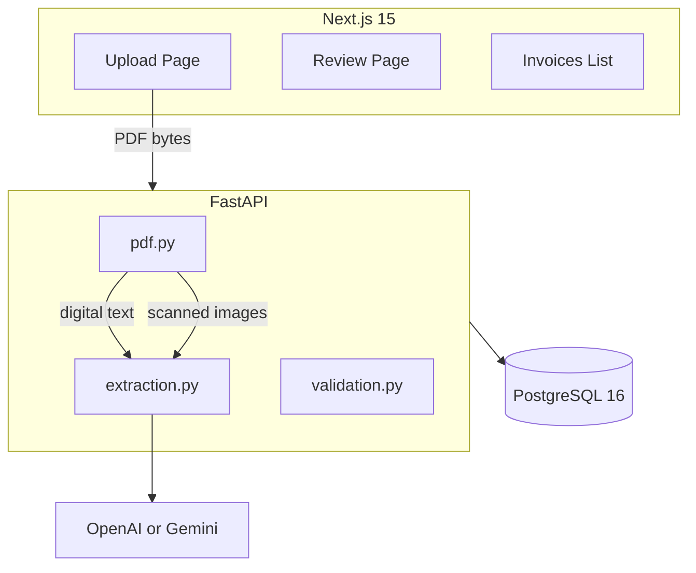

# InvoiceAI

AI-powered invoice data extraction with human review. Upload PDF invoices, extract structured fields using OpenAI or Google Gemini, review with confidence scoring, and save to PostgreSQL.

## Key Features

- **Dual-mode PDF processing** — digital PDFs use text extraction (~$0.002/invoice); scanned PDFs use GPT-4o Vision (~$0.015/page, max 3 pages)
- **Human review workflow** — per-field confidence badges, sanity-check warnings, approve/reject/draft
- **Duplicate detection** — file hash + vendor/invoice number matching
- **Re-extract with diff** — re-upload PDF, compare AI vs current values field-by-field
- **Export** — CSV and Excel with filters
- **Cost transparency** — tokens, duration, and USD cost tracked per extraction

## Architecture



## Accuracy Approach

1. **Detect PDF type** — pdfplumber text threshold (100 chars) routes digital vs scanned
2. **Extract** — text mode for digital, vision mode for scans (pages 1, 2, last)
3. **Validate** — Pydantic schema validation with one retry on malformed AI output
4. **Sanity checks** — tax > total, date ordering, future dates, amount bounds
5. **Human review** — low-confidence fields flagged for verification

## Quick Start

```bash
cp .env.example .env
# Fill in POSTGRES_PASSWORD, SECRET_KEY, NEXTAUTH_SECRET
# Set LLM_PROVIDER=openai + OPENAI_API_KEY, or LLM_PROVIDER=gemini + GEMINI_API_KEY

docker-compose up --build
```

1. Open http://localhost:3000
2. Register an account
3. Upload a PDF invoice
4. Review extracted fields and approve

## API Endpoints

| Method | Endpoint | Description |
|--------|----------|-------------|
| POST | `/api/auth/register` | Create account |
| POST | `/api/auth/login` | Get JWT token |
| GET | `/api/auth/me` | Current user |
| POST | `/api/invoices/upload` | Upload and extract PDF |
| GET | `/api/invoices` | List with search/filter/sort |
| GET | `/api/invoices/{id}` | Get single invoice |
| PATCH | `/api/invoices/{id}` | Update fields/status |
| POST | `/api/invoices/{id}/re-extract` | Re-extract from re-uploaded PDF |
| POST | `/api/invoices/{id}/apply-diff` | Apply per-field AI/current choices |
| DELETE | `/api/invoices/{id}` | Delete invoice |
| GET | `/api/invoices/export/csv` | Export CSV |
| GET | `/api/invoices/export/excel` | Export Excel |
| GET | `/api/stats` | Dashboard statistics |
| GET | `/health` | Health check |

## Running Tests

```bash
# Backend unit + integration (mocked LLM)
cd backend && pip install -r requirements.txt && pytest tests/unit tests/integration -v

# Frontend
cd frontend && npm install && npm test

# Accuracy suite (local only, requires OPENAI_API_KEY or GEMINI_API_KEY)
cd backend && pytest tests/accuracy/ -v -m accuracy
```

## LLM Provider

Set `LLM_PROVIDER` in `.env` to choose the extraction backend:

| Provider | Env vars | Default model |
|----------|----------|---------------|
| `openai` (default) | `OPENAI_API_KEY` | `gpt-4o` |
| `gemini` | `GEMINI_API_KEY` | `gemini-2.0-flash` |

Optional overrides: `OPENAI_MODEL`, `GEMINI_MODEL`.

Get a free Gemini API key at [Google AI Studio](https://aistudio.google.com/apikey).

## Cost Transparency

OpenAI GPT-4o pricing (approximate):
- Input: $2.50 / 1M tokens
- Output: $10.00 / 1M tokens

Typical costs:
- Digital PDF: ~$0.002 per invoice
- Scanned PDF (1 page): ~$0.015
- Scanned PDF (3 pages max): ~$0.045

Gemini 2.0 Flash is significantly cheaper and has a generous free tier.

## Limitations

- PDFs are **not stored** after extraction — preview only available in the upload session
- Scanned PDFs render max 3 pages (first, second, last)
- Re-extract requires re-uploading the original PDF
- Primary language support: English (other locales supported via locale detection)
- Single shared workspace — no multi-tenancy
- Rate limited to 10 uploads/minute per user

## Tech Stack

- **Frontend**: Next.js 15, TypeScript, Tailwind CSS, shadcn/ui, NextAuth v5
- **Backend**: FastAPI, SQLAlchemy 2.0 (async), Alembic, Pydantic v2
- **Database**: PostgreSQL 16
- **AI**: OpenAI GPT-4o or Google Gemini (configurable via `LLM_PROVIDER`)
- **PDF**: pdfplumber + pdf2image (poppler)
- **Deploy**: Docker Compose (3 services)
